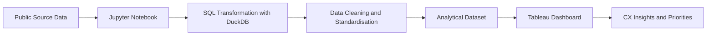

# Customer Experience Benchmarking

# Customer Experience Benchmarking


An end-to-end Customer Experience analytics project built with public satisfaction data.

The solution combines **Python, SQL, DuckDB, Jupyter Notebook and Tableau** to transform raw data into an analytical benchmark across industries, customer journey stages, service channels and customer segments.

---

## Project Overview

Customer satisfaction data becomes difficult to interpret when performance is distributed across multiple channels, journey stages and customer profiles.

This project was designed to identify:

* the weakest stages of the customer journey;
* the channels generating the greatest dissatisfaction;
* critical interactions between channels and journey stages;
* differences in experience across customer segments;
* the areas with the highest potential for operational improvement.

The final output is an interactive Tableau dashboard focused on benchmarking, prioritisation and strategic decision-making.

---

## Dashboard

The dashboard provides five complementary perspectives:

* **Industry Benchmarking**
* **Customer Journey Performance**
* **Channel Performance**
* **Channel × Journey Analysis**
* **Journey × Customer Segment Analysis**

> Higher scores represent stronger Customer Experience performance.

---

## Key Insights

The analysis highlights several critical Customer Experience patterns:

* **Cancellation is the weakest journey stage**, with the lowest overall satisfaction score.
* **Chatbot is the lowest-performing channel**, indicating limitations in automated customer support.
* **Call centre interactions during cancellation represent the most critical channel–journey combination.**
* Complaints and customer service show consistently weak results across multiple channels.
* Onboarding presents isolated positive performance across selected channels and customer segments.
* Satisfaction varies significantly between customer profiles, reinforcing the need for segmented improvement strategies.

The results indicate that the highest-impact opportunities are concentrated in:

* cancellation prevention;
* complaint management;
* service recovery;
* chatbot effectiveness;
* human support during critical journey stages.

---

## Technology Stack

| Technology       | Application                                            |
| ---------------- | ------------------------------------------------------ |
| Python           | Data ingestion, validation and workflow support        |
| Pandas           | Initial data inspection and manipulation               |
| SQL              | Data cleaning, transformation and analytical modelling |
| DuckDB           | SQL execution directly inside the Jupyter environment  |
| Jupyter Notebook | Development and documentation of the data pipeline     |
| Tableau          | Interactive dashboard and visual storytelling          |

---

## Data Pipeline



The analytical workflow covers:

1. ingestion and inspection of the source data;
2. treatment of missing and inconsistent values;
3. standardisation of categories and dimensions;
4. transformation using SQL queries inside Jupyter;
5. creation of analytical dimensions and aggregated indicators;
6. validation of the processed dataset;
7. export of a Tableau-ready analytical table;
8. development of the interactive dashboard.

---

## Analytical Dimensions

### Industry

Performance benchmarking across different business sectors.

### Customer Journey

Analysis of stages such as:

* onboarding;
* payment;
* app and website usage;
* renewal;
* customer service;
* complaints;
* cancellation.

### Channel

Comparison between interaction channels such as:

* mobile application;
* website;
* human service;
* call centre;
* chatbot;
* physical store or branch.

### Customer Segment

Evaluation of Customer Experience across different income and business profiles.

---

## Data Preparation

Data cleaning and analytical modelling were performed using **SQL queries executed through DuckDB inside a Jupyter Notebook**.

The main transformations include:

* data-type standardisation;
* treatment of missing values;
* normalisation of categorical fields;
* creation of customer journey dimensions;
* standardisation of channel and segment labels;
* aggregation of satisfaction indicators;
* validation of analytical outputs;
* generation of the final dataset used in Tableau.

This approach keeps the transformation process documented, reproducible and connected to the analytical objective.

---

## Repository Structure

```text
anatel-customer-experience-analytics/
│
├── data/
│   ├── raw/
│        └── anatel_cx_processed.csv
│ 
├── notebooks/
│   └── anatel_cx_pipeline.ipynb
│
├── tableau/
│   └── anatel_cx_dashboard.twbx
│
├── README.md
└── requirements.txt
```

---

## Data Source

The project uses publicly available customer satisfaction data.

The original dataset source and download instructions are documented in:

```text
data/raw/README.md
```

The processed analytical dataset used in Tableau is available in:

```text
data/processed/anatel_cx_processed.csv
```

---

## Business Applications

This analytical framework can support initiatives involving:

* Customer Experience strategy;
* customer journey redesign;
* complaint reduction;
* churn and cancellation prevention;
* digital channel optimisation;
* service performance benchmarking;
* customer segmentation;
* prioritisation of operational improvements.

---

## Author

**Arthur Fermino França**

Data Analytics, Business Intelligence, Automation and Applied AI.

[LinkedIn](INSERT_LINKEDIN_URL) • [GitHub](INSERT_GITHUB_URL)
